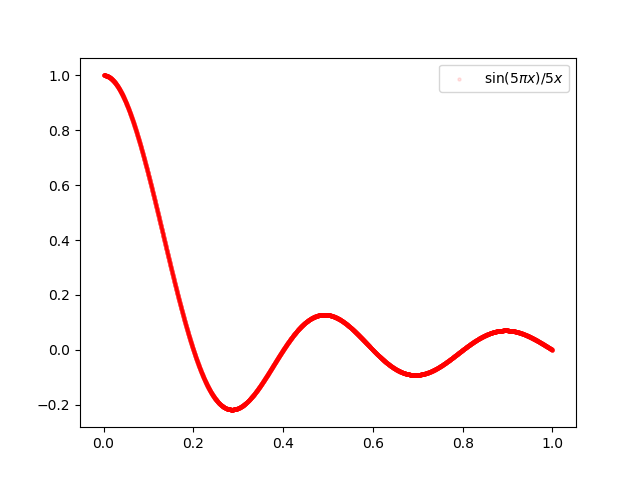
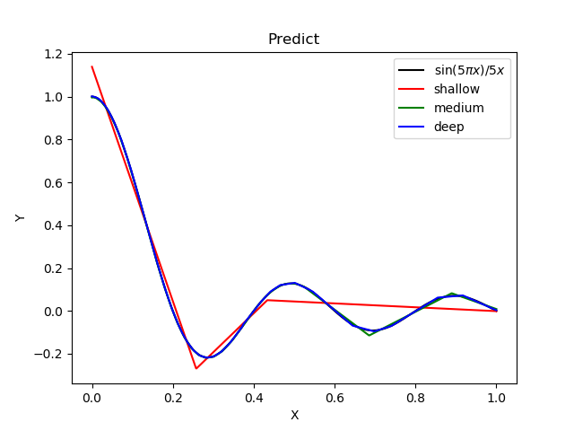
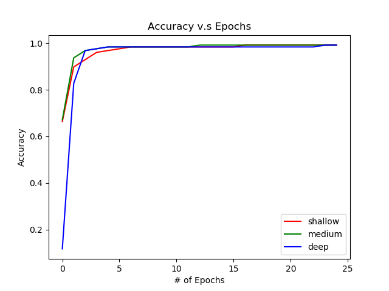
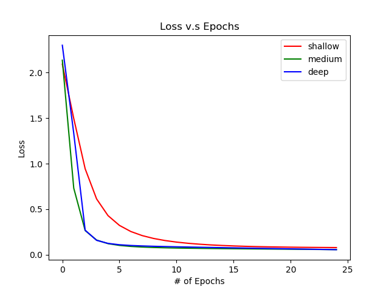

# Homework 1-1

## Purpose:

* Simulate a function: 本次作業希望透過模擬一個函數來了解 shallow structure 和 deep structure 之間的差異。試著去了解 deep structure 相對於 shallow 來的有 power。

* Train  on actual task:

## Data 簡介

* Simulate a function: 透過 numpy 的函數 sinc 生成  共 10000 筆。x 軸範圍在 0.0001 ~ 1 之間，y 軸在 -0.2 ~ 1。如下圖所示:

 

* Train  on actual task:

## Summary 總結

### Simulate a function

我們嘗試了三個不同深度的模型，每一層均是 fully connection。在參數量接近的情況下，了解越深的模型可以模擬越複雜的函數，或者是說可以將函數配式的越好。模型結構如下:

| model | # of layers | # of parameters |
| --- | --- | --- |
| shallow model | 3 | 571 |
| medium model | 6 | 572 |
| deep model | 9 | 571 |

下圖為三個模型 training 過程中 loss 的狀況。可以觀察到 deep 模型所模擬出來的函數跟目標函數間的誤差最小。

下圖為三個模型 predict 的狀況。可以觀察到 deep 模型幾乎跟目標函數相同，而 medium 模型在波峰或波谷的地方預測的狀況比較差。shallow 只能捕捉到大方向的趨勢，對於細節的部分則完全不行。

### Train  on actual task

| model | # of layers | # of parameters |
| --- | --- | --- |
| cnn shallow model | 3 | 101560 |
| cnn medium model | 5 | 101266 |
| cnn deep model | 7 | 101398 |

# Reference

* [原始作業說明](https://docs.google.com/presentation/d/1VllCXAZ_DCN409MpmbsDV73wopoUt4gxyo47kPC1NGQ/edit#slide=id.p3)
