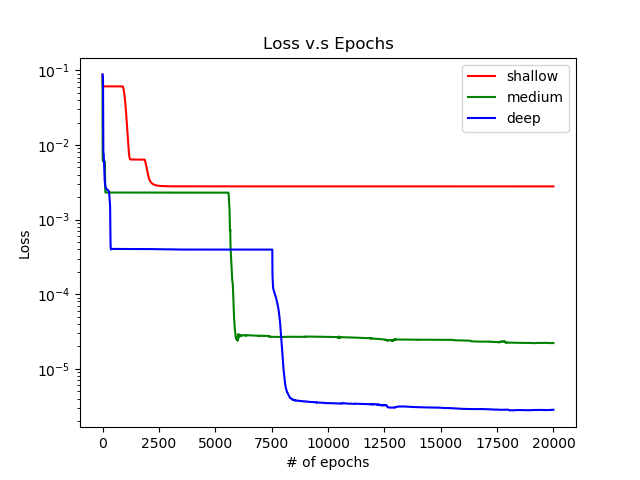

# Homework 1-1

## Purpose:

* Simulate a function: 本次作業希望透過模擬一個函數來了解 shallow structure 和 deep structure 之間的差異。試著去了解 deep structure 相對於 shallow 來的有 power。

* Train  on actual task:

## Data 簡介

* Simulate a function: 透過 numpy 的函數 sinc 生成  共 10000 筆。x 軸範圍在 0.0001 ~ 1 之間，y 軸在 -0.2 ~ 1。如下圖所示:

 

* Train  on actual task:

## Summary 總結

### Simulate a function

| model | # of layers | # of parameters |
| --- | --- | --- |
| shallow model | 3 | 571 |
| medium model | 6 | 572 |
| deep model | 9 | 571 |

### Train  on actual task

# Reference

* [原始作業說明](https://docs.google.com/presentation/d/1VllCXAZ_DCN409MpmbsDV73wopoUt4gxyo47kPC1NGQ/edit#slide=id.p3)
