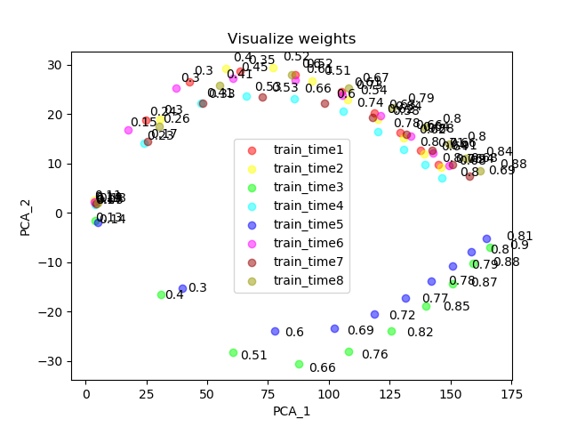

# Homework 1-2

## Purpose:

* Visualize the Optimization Process:

* Observe Gradient Norm During Training:

* What Happened When Gradient is Almost Zero:

## Data 簡介

## Summary 總結

### Visualize the Optimization Process

### Observe Gradient Norm During Training

### What Happened When Gradient is Almost Zero

# Reference

* [原始作業說明](https://docs.google.com/presentation/d/1siUFXARYRpNiMeSRwgFbt7mZVjkMPhR5od09w0Z8xaU/edit#slide=id.p3)
