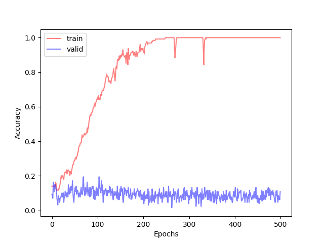
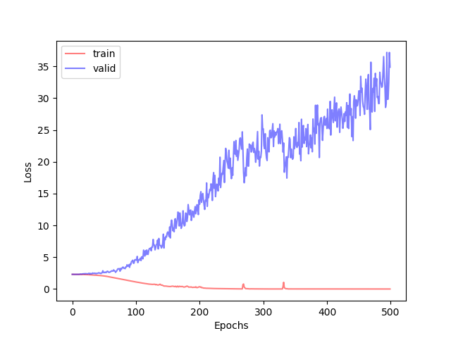
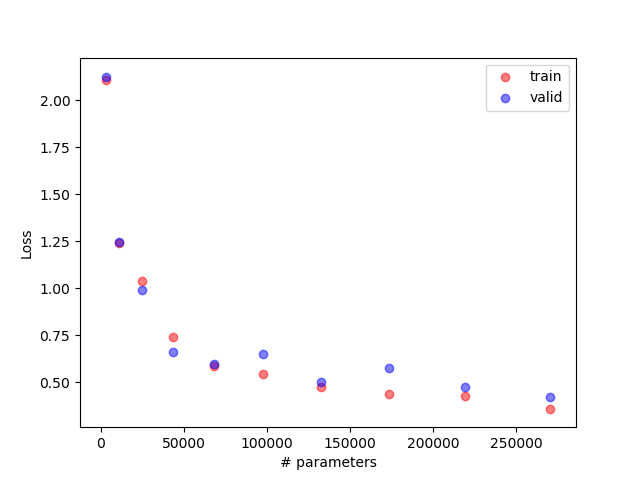
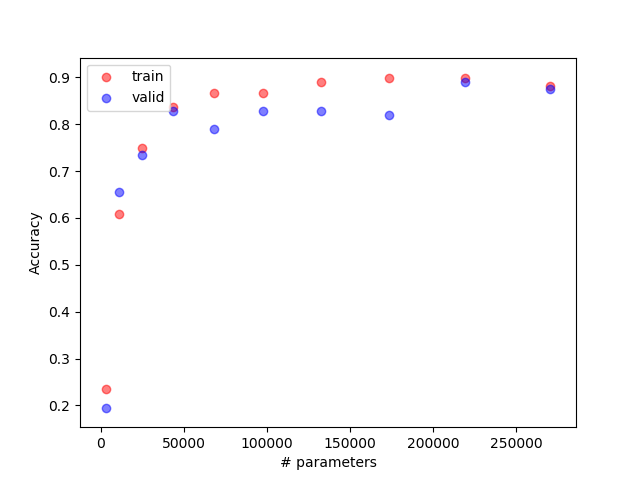
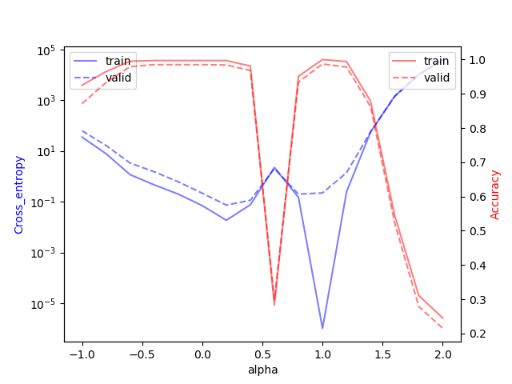
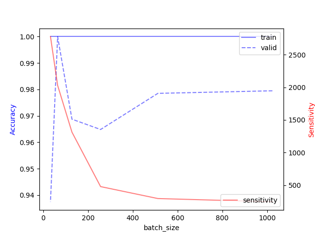
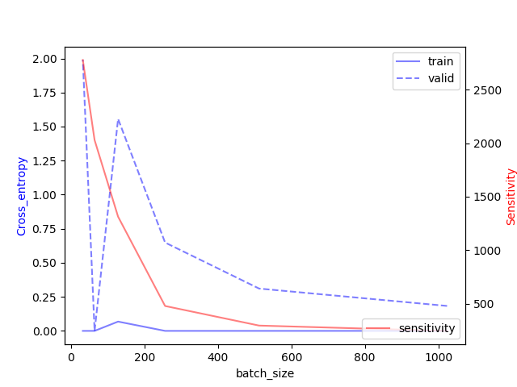

# Homework 1-3

## Purpose: 

* Can network fit random labels?: 希望透過此實驗來瞭接 deep model 是相當有 power 的
* Number of parameters v.s. Generalization: 在相同模型結構的前提下，觀察參數越多時 loss 和 accuracy 的變化

## Data 簡介

Mnist dataset: 參考 [Center Loss Visualization project](https://github.com/machineCYC/SideProjects/tree/master/01-CenterLossVisualization) 的說明

## Summary 總結

### Can network fit random labels?

隨機從 mnist training datasets 中抽出 5000 筆當訓練資料，將相對應的 label 隨機更換。batch size 128, epoch 500, learning rate 1e-4。從實驗中可以發現 model 是可以將擁有錯誤 label 的訓練資料完整學習下來。

由下圖的 loss 和 accuracy 可以知道 model 過度的擬和訓練資料，訓練 loss 接近 0， accuracy 接近 1。但在驗證資料上面表現的就相當差。

由此實驗可以清楚的知道 deep model 是擁有將所有訓練資料記下來的能力，但也因為這樣會過擬和資料。

    
    

### Number of parameters v.s. Generalization

隨機從 mnist training datasets 中抽出 2000 筆當訓練資料。模型結構為 conv -> dense -> output 共三層，batch size 128, epoch 50, learning rate 1e-4。除此之外，訓練 10 個相同結構但 conv filter 數量為 2、4、6、8...20，dense 層神經元數量為 2、4、6、8...20。

由下圖可以得知隨著參數的數量越來越多，模型的 loss 和 accuracy 不論在 training 還是 validation 都越來越好。另外可以觀察到當模型參數數量大於 5 萬時，loss 下降速度開始變小，而 accuracy 上升速度也變小。由此可以推測 5 萬個參數的模型已經有足夠的能力去學習這個數據。而更特別的現象則是也沒有因為模型的數量越來越多，導致 overfitting 的現象出現。

    
    

### Flatness v.s. Generalization - part1

隨機從 mnist training datasets 中抽出 55000 筆當訓練資料。模型結構為 conv1 -> conv2 -> conv3 -> dense -> output 共五層，epoch 500、batch size 1024、64, 對應的 learning rate 為 1e-2, 1e-3。最後將兩個模型的參數取出，根據插指法得到的參數針對 test data 中前 1000 筆資料 predict。

由下圖可以得知兩個不同的模型會有不同的局部解，alpha 為 0 時 batch size 1024、 learning rate 1e-2，alpha 為 1 時 batch size 64、 learning rate 1e-3。在 training 的部分可以發現小的 batch size 會有小的 loss。validation 的 loss 相對於 training 來的大，可能如老師課堂上所說，validation 的 loss 曲面會跟 training 相似，但會在某些維度上會有偏差。

### Flatness v.s. Generalization - part2

隨機從 mnist training datasets 中抽出 55000 筆當訓練資料。模型結構為 conv -> output 共兩層，epoch 200、learning rate 1e-2。batch size 依序為 1024, 512, 256, 128, 64, 32。

由下圖可以得知，隨著 batch size 越來越大，sensitivity 越來越小，趨近於 0。也意味著模型對資料的敏感性越來越小。敏感度越低也太表著模型較容易受到資料偏移的影響。由下圖也可以發現 loss 的低點和 accuracy 的高點都出現在 batch size 以較小的地方。

    
    

# Reference

* [原始作業說明](https://docs.google.com/presentation/d/18swR-wgvVWwiOds1cUrBbouAfd3YBRUC6RLUMoiUrns/edit#slide=id.p3)

* [SENSITIVITY AND GENERALIZATION IN NEURAL NETWORKS: AN EMPIRICAL STUDY(2018)](https://arxiv.org/pdf/1802.08760.pdf)